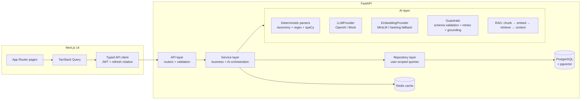
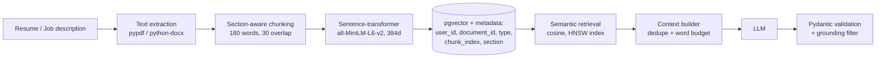

# AI Career Copilot

> Your AI-powered personal career assistant.

**🔴 Live demo:** <https://web-production-41ed7.up.railway.app>
&nbsp;·&nbsp; API: <https://api-production-3cc8.up.railway.app/docs>

A production-style, full-stack AI application that unifies the entire job-search
workflow: resume analysis, ATS-style checks, semantic job matching, skill-gap
analysis, learning roadmaps, AI resume improvement, mock interviews and
application tracking.

**Stack:** FastAPI · PostgreSQL + pgvector · SQLAlchemy/Alembic · Sentence-Transformers ·
Next.js 14 · TypeScript · Tailwind CSS · TanStack Query · Redis · Docker · GitHub Actions

---

## Why this is not a ChatGPT wrapper

- **Hybrid AI pipeline** — deterministic parsing (regex, section heuristics, a
  curated skill taxonomy) runs first; the LLM only *refines* drafts, and its
  output is schema-validated and **grounded against the source text** (anything
  unsupported is dropped).
- **Genuine RAG** — documents are chunked section-aware, embedded with
  `all-MiniLM-L6-v2`, stored in **pgvector** with per-chunk metadata, and
  retrieved with cosine distance inside PostgreSQL.
- **Explainable scoring** — every resume score and job match is a documented,
  configurable weighted formula with per-component explanations and resume
  evidence. No black-box numbers.
- **Cost-aware** — deterministic code wherever an LLM is unnecessary, content-hash
  caching for job analyses, embedding reuse, token-bounded contexts, and a
  `MockProvider` so the entire product runs with **zero API keys**.
- **Engineering quality** — clean architecture (API → services → repositories →
  DB), JWT auth with refresh rotation, user-scoped authorization at the
  repository level, structured JSON logging, rate limiting, 51 backend + 16
  frontend tests, CI, Docker.

## Features

| Area | What it does |
|---|---|
| Resume analysis | Weighted score (ATS 25%, skills 20%, experience 20%, projects 15%, keywords 10%, structure 10%) with explanations & recommendations |
| ATS-style checks | Sections, contact info, action verbs, quantified impact, keyword stuffing — clearly labeled as a heuristic simulation, not a real ATS |
| Job analysis | Required/preferred skills, responsibilities, keywords, experience & education requirements from any pasted JD |
| Semantic matching | 40% embedding similarity + 25% required skills + 15% preferred + 10% experience + 5% education + 5% keywords (all configurable) |
| Explainability | Strong / partial / missing skills with verbatim resume evidence for every match |
| Skill gaps | Critical / important / nice-to-have, derived only from evidence-backed skills |
| Learning roadmaps | Week-by-week plans tailored to what you already know; no fabricated course URLs |
| Resume improvement | Bullet rewrites that preserve every fact; missing metrics are *suggested*, never invented |
| Mock interviews | RAG-grounded questions from your actual resume + target job, structured feedback per answer, final report |
| Applications | Full tracker (saved → applied → … → offer) with funnel analytics |
| Dashboard | Score history, match distribution, application funnel, interview performance |

## Architecture



### RAG pipeline



More detail: [docs/architecture.md](docs/architecture.md) · [docs/ai.md](docs/ai.md) ·
[docs/api.md](docs/api.md) · [docs/evaluation.md](docs/evaluation.md) ·
[docs/deployment.md](docs/deployment.md)

## Quick start (Docker)

```bash
cp .env.example .env          # defaults work out of the box (mock LLM)
docker compose up --build
```

- Web: http://localhost:3000
- API + OpenAPI docs: http://localhost:8000/docs

Optional demo data:

```bash
pip install httpx python-docx
python scripts/seed_demo.py --api http://localhost:8000
# log in with demo@example.com / DemoPassword123!
```

> **AI providers.** By default the app runs with `LLM_PROVIDER=mock` (a
> deterministic, grounded mock — no API key needed) and, in the slim Docker
> image, a lexical fallback embedder. For real AI quality set
> `LLM_PROVIDER=openai`, `LLM_API_KEY=...` and build with `INSTALL_ML=true
> docker compose up --build` to enable sentence-transformer embeddings.
> `GET /health` always reports which providers are active.

## Local development

**Backend** (Python 3.10+):

```bash
cd apps/api
python -m venv .venv && .venv/Scripts/activate    # Windows
pip install -r requirements-dev.txt               # + requirements-ml.txt for real embeddings
alembic upgrade head                              # uses DATABASE_URL (defaults to SQLite)
uvicorn app.main:app --reload
```

**Frontend** (Node 20+):

```bash
cd apps/web
npm install
npm run dev        # http://localhost:3000
```

## Environment variables

See [.env.example](.env.example). Key ones:

| Variable | Purpose | Default |
|---|---|---|
| `DATABASE_URL` | SQLAlchemy URL (PostgreSQL in prod, SQLite works for dev/tests) | sqlite |
| `JWT_SECRET` | HS256 signing secret — generate a long random value | dev placeholder |
| `LLM_PROVIDER` / `LLM_API_KEY` | `mock` or `openai` | `mock` |
| `EMBEDDING_PROVIDER` | `sentence-transformer` or `hashing` | `sentence-transformer` |
| `REDIS_URL` | optional cache; in-memory fallback when unset | — |
| `RESUME_SCORE_WEIGHT_*` / `MATCH_WEIGHT_*` | scoring weight overrides | documented defaults |

## Testing

```bash
# Backend: 51 tests (unit + API integration), ruff lint
cd apps/api && pytest tests -q && ruff check app tests

# Frontend: 16 tests (vitest + Testing Library), typecheck, lint
cd apps/web && npm test && npm run typecheck && npm run lint

# AI evaluation harness (skill P/R/F1, extraction accuracy, ranking sanity)
cd apps/api && python -m evals.run
```

CI (GitHub Actions) runs lint, tests, a pgvector migration check and Docker
builds on every push/PR — see [.github/workflows/ci.yml](.github/workflows/ci.yml).

## Security & privacy

- PBKDF2-SHA256 password hashing; refresh tokens stored hashed and rotated on use
- Every repository query is user-scoped — cross-user access returns 404
- Upload defense-in-depth: extension allowlist, size limit, magic-byte checks,
  random storage names
- Security headers, CORS allowlist, rate limiting, no stack traces to clients
- Structured logs redact passwords/tokens and never include resume content
- Users can delete resumes (file + rows + embeddings) or their entire account

## Limitations (honest notes)

- The ATS analysis is a **heuristic simulation** for guidance; real ATS systems
  are proprietary and vary.
- Evaluation datasets are small and synthetic — numbers in
  [docs/evaluation.md](docs/evaluation.md) are indicative, not benchmarks.
- The mock LLM provider produces grounded but template-like text; production
  quality requires a real provider.
- Background processing uses FastAPI background tasks (single-process). The
  service layer is structured so a Celery/Redis queue can be dropped in for
  scale — see docs/architecture.md.
- No email verification / password-reset delivery (the token architecture
  supports it; SMTP integration is future work).

## Future improvements

Job-board ingestion, cover-letter drafting (grounded), Celery workers,
multi-resume versioning with diffing, richer admin analytics, e2e tests
(Playwright), i18n.

## License

MIT — see [LICENSE](LICENSE).
