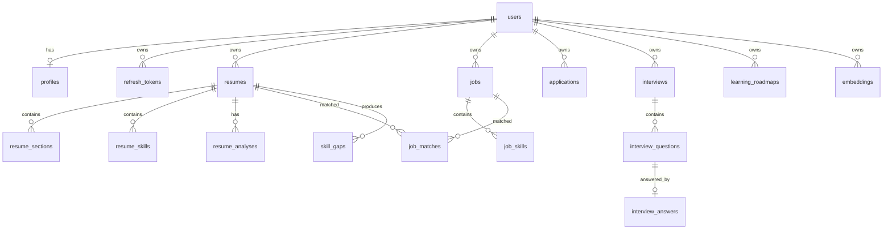

# Architecture

## Monorepo layout

```
ai-career-copilot/
├── apps/
│   ├── api/                  # FastAPI backend
│   │   ├── app/
│   │   │   ├── api/          # routers (thin: validation + delegation)
│   │   │   ├── core/         # config, security, logging, cache, errors, rate limit
│   │   │   ├── db/           # engine/session, declarative base, custom types
│   │   │   ├── models/       # SQLAlchemy models
│   │   │   ├── schemas/      # Pydantic schemas (requests, responses, LLM contracts)
│   │   │   ├── repositories/ # data access, user-scoped
│   │   │   ├── services/     # business logic + AI orchestration
│   │   │   ├── ai/           # llm/, embeddings/, parsing/, rag/, scoring/, guardrails
│   │   │   └── data/         # skill taxonomy, action verbs
│   │   ├── alembic/          # migrations
│   │   ├── evals/            # AI evaluation harness + labeled data
│   │   └── tests/            # pytest suite
│   └── web/                  # Next.js 14 frontend (App Router)
├── data/samples/             # synthetic sample resume + job descriptions
├── docs/                     # this documentation
├── scripts/                  # seed + utilities
└── docker-compose.yml
```

## Layering rules

```
API layer  →  Service layer  →  Repository layer  →  Database
                    ↓
                AI layer (providers, parsing, RAG, scoring)
```

- **API layer** does request/response validation, dependency injection and
  error mapping only. No business logic.
- **Services** own workflows and transactions; they are the only layer that
  calls the AI package.
- **Repositories** own SQL. Every query on user-owned data filters by
  `user_id`, so authorization cannot be forgotten upstream (cross-user access
  is a 404 by construction).
- **AI layer** is isolated from business logic: services pass plain data in and
  receive validated Pydantic models back.

## Database design

17 tables, UUID primary keys, FK constraints with appropriate `ON DELETE`
behavior, timestamps everywhere, soft deletion (`deleted_at`) on resumes, jobs
and applications.

Key relationships:



Notable decisions:

- **`embeddings`** stores one row per chunk with `user_id`, `document_id`,
  `document_type`, `chunk_index`, `content`, `meta` (section) and a
  `vector(384)` column. Composite indexes on `(document_id, document_type)` and
  `(user_id, document_type)` narrow candidates before the HNSW cosine index
  ranks them.
- **Cross-dialect vector type** (`EmbeddingVector`): pgvector's `vector` on
  PostgreSQL, JSON text on SQLite. Unit tests run on SQLite with in-Python
  cosine; production uses in-database `<=>` ranking. Same repository API.
- **JSON columns** hold validated AI artifacts (parsed resume, job analysis,
  match explanations). They are always written through Pydantic validation, so
  shape is guaranteed at the boundary.
- **Refresh tokens** are stored as SHA-256 hashes with expiry + revocation
  timestamps; rotation on every refresh.

## Authentication

- Register/login issue an access token (30 min) + refresh token (7 days).
- Refresh rotates: the used token is revoked, a new pair is issued; reuse of a
  rotated token fails (mitigates token theft).
- Password change / account deletion revoke all refresh tokens.
- Frontend keeps tokens in `localStorage` and performs single-flight refresh on
  401 with one retry.

## Background processing

Resume processing (text extraction → hybrid parsing → skill extraction →
sectioning → RAG indexing) runs in a FastAPI background task with its own DB
session. The resume row carries a `status` state machine
(`pending → processing → completed|failed`) that the frontend polls.

The pipeline is a single service method (`ResumeService.process`) with no
web-framework coupling, so promoting it to a Celery task is a ~10-line change:
serialize `resume_id`, run the same method in a worker. This was deliberately
deferred (YAGNI for a single instance) but designed for.

## Caching

`app.core.cache` exposes one interface with two implementations:

- **RedisCache** when `REDIS_URL` is set and reachable
- **InMemoryCache** fallback (thread-safe TTL dict) otherwise

Cached: per-user dashboard aggregates (invalidated on every relevant write),
job analyses keyed by **content hash** (identical JD → zero AI cost), and AI
usage counters for the admin panel. Raw resume text is never cached.

## Observability

- Structured JSON logs with `request_id` (contextvar, set per request),
  `user_id`, endpoint, status, latency and AI operation fields.
- `X-Request-ID` response header for correlation; error responses include it.
- Guardrails log every AI call (provider, task, latency, attempt) and count
  requests/errors for `GET /api/admin/stats`.
- Redaction: passwords, tokens and API keys are stripped from structured logs;
  resume content is never logged.

## Error handling

Domain errors (`app/core/errors.py`) map to HTTP responses in one exception
handler: `{code, message, request_id}`. Unhandled exceptions return a generic
500 — stack traces are logged server-side only. Validation errors are condensed
into a single user-friendly message.

## Scale path (interview-ready answers)

- **1M users**: stateless API behind a load balancer; move rate limiting and
  the cache to Redis; Celery workers for parsing/embedding; pgvector with HNSW
  scales to millions of chunks — beyond that, partition embeddings by user
  shard or move to a dedicated vector store.
- **Embedding throughput**: batch encode (already batched per document), GPU
  worker pool, queue with backpressure.
- **LLM costs**: content-hash caching (done), smaller models for extraction vs
  generation, token budgets (done), prompt reuse (done), and batch endpoints.
